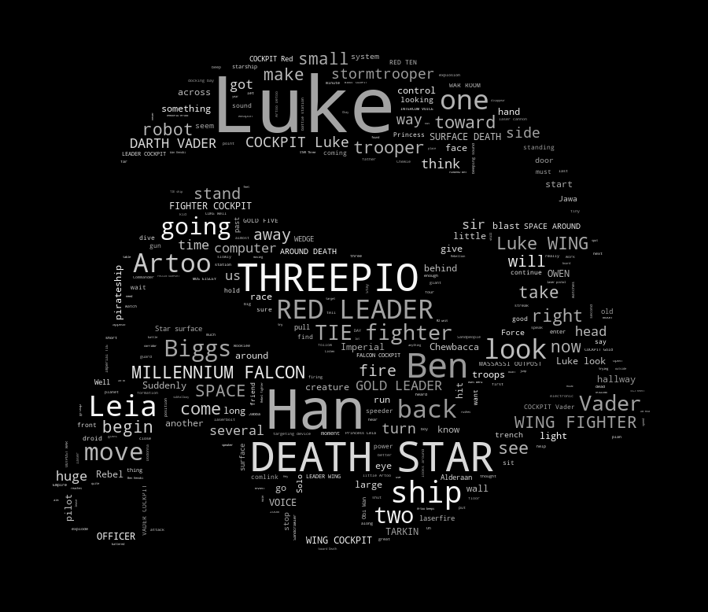

This week, we spoke about text mining and sentiment analysis.  Most of the material came from <http://tidytextmining.com/>.  While this is not the only way to mine textual data, it fits nicely into the tidy process we used in our search for Reproducible Analysis.

## Problem 2: Text analysis

Duplicate one of the following analyses in Python in an R Notebook.  

<https://github.com/amueller/word_cloud>

From the link above, I have taken code from the a_new_hope.py file. I have slightly adjusted the code so that it will work on my computer and with Python 3.

```{python, engine.path = '/Library/Frameworks/Python.framework/Versions/3.5/bin/python3'}
# import the necessary packages
import numpy as np
from PIL import Image
from os import path
import matplotlib.pyplot as plt
import random
from wordcloud import WordCloud, STOPWORDS

# create function to change default wordcloud colors to white/grey
def grey_color_func(word, font_size, position, orientation, random_state=None,
                    **kwargs):
    return "hsl(0, 0%%, %d%%)" % random.randint(60, 100)

# store the file path of the folder containing text and images
d = '/Users/bobbysoule/Documents/College/Graduate/Grad_GitHub/STAT_5014/'

# read and store the stormtrooper mask image
# taken from: http://www.stencilry.org/stencils/movies/star%20wars/storm-trooper.gif
mask = np.array(Image.open(d+'stormtrooper_mask.png'))

# read and store movie script of "a new hope"
# written by George Lucas
# script found at: http://www.imsdb.com/scripts/Star-Wars-A-New-Hope.html
text = open(d+'a_new_hope.txt').read()

# preprocessing the text a little bit
text = text.replace("HAN", "Han")
text = text.replace("LUKE'S", "Luke")

# adding movie script specific stopwords
stopwords = set(STOPWORDS)
stopwords.add("int")
stopwords.add("ext")

# create word cloud
wc = WordCloud(max_words=1000, mask=mask, stopwords=stopwords, margin=10, random_state=1).generate(text)
wc.recolor(color_func=grey_color_func, random_state=3) # change colors to grey
wc.to_file(d+'a_new_hope.png') # save as png file (cannot print image directly in rnotebook)
```

In the above code, we first import of all of the packages we will use; the import statement in Python is similar to the library() function in R. Next, we create a function that will later be used to change the default colors of the word cloud to white and grey colors; after all, we don't want a colorful stormtrooper! After storing the path of the folder contaiing our files, we read in and store the mask image and the movie script text. Before creating the word cloud, we first do some preprocessing of the script, and we add some movie specific stop words to the stop words list. Finally, we create our wordcloud and we use the funciton we created earlier to change the colors of the words. Note that I have removed several lines of code that were placed after the creation of the word cloud. These lines were using Python's matplotlib package to plot the image. Since we cannot directly print Python visuals in an R Notebook, we will instead save the word cloud as a png file. The final image of the stormtrooper word cloud can be seen below. 


